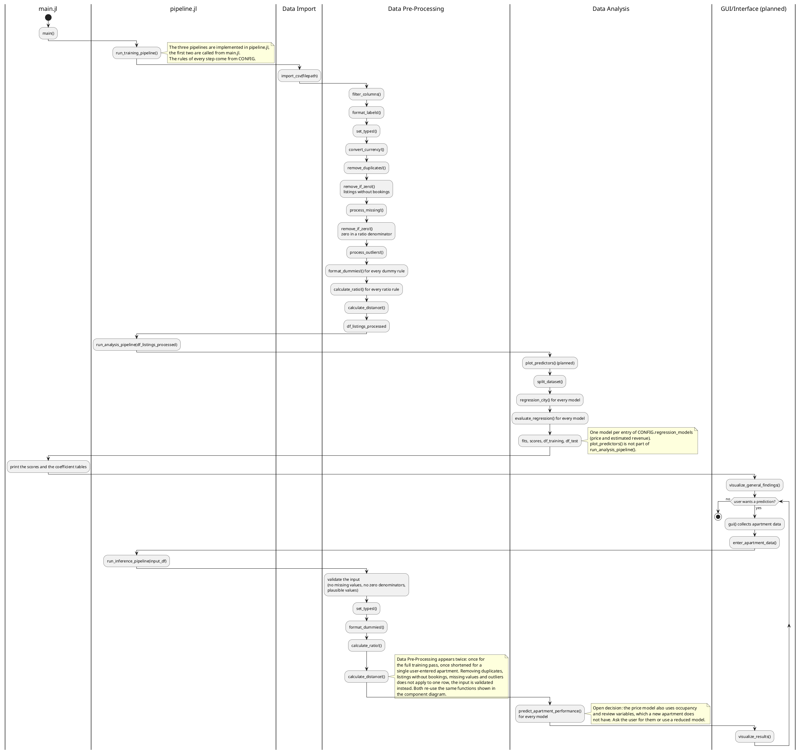

# Project design

The program consists of four functional components, main and config: 

(1) Data import (data_import.jl)
(2) Data pre-processing (data_pre_processing.jl)
(3) Data analysis (data_analysis.jl)
(4) GUI/interface (user_interface.jl)
(5) Config (config.jl)
(6) Main (main.jl)

The analysis is performed based on listings.csv files obtained from https://insideairbnb.com/get-the-data/ each containing data on AirBnB apartments in a city that is imported (1), processed (2) and used in a regression model (3). The model is used to predict apartment pricing and estimated revenue based on user input (3)+(4). A config file (5) is used to provide a constant set of inputs for the data pre-processing steps and allows for simple changes to the data pre-processing pipeline without requiring changes in the code. The program is executed from main (6) that also contains two processing pipelines, run_training_pipeline() and run_inference_pipeline() that sequentially execute the necessary data pre-processing steps on the training data and the user input. All functions have corresponding tests in runtests.jl using the Test package.

In the following a detailed explaination is provided of each component and the functions including input and output:

(1) Data import (data_import.jl) includes an import_csv() function that takes a path and imports the CSV file at that location and puts the data into a DataFrame df_listings. The function is executed as part of run_training_pipeline() in main that recieves a filepath and then runs (1) and (2) sequentially

(2) Data pre-processing (data_pre_processing.jl) takes the raw df_listings DataFrame and perfoms a set of functions to clean up the data set in order to make it usable in the later regression function and avoid any issues. All functions except the filter_columns() function mutate the DataFrame instead of returning a new copy (signified by ! in the function name), only the first function filter_columns() returns a modified copy in order to retain the original raw data. The functions are executed as part of run_training_pipeline() in main that recieves a filepath and then runs (1) and (2) sequentially, as well as run_inference_pipeline() in main that takes a single-row DataFrame of user input about an apartment and conducts all the necessary processing steps in order for the model to predict based on the data given. The component includes functions to...

  ... (2.1) remove data that is not relevant to the regression analysis: 
        - filter_columns() takes a DataFrame and an array containing the column indices/names of all columns not used in the regression model and removes these columns, then returns the processed DataFrame.
        - [only after 2.2] remove_duplicates!() mutates a given input DataFrame. The function takes a DataFrame as input and runs an algorith to identify and remove duplicate entries
        - [only after 2.2] remove_no_bookings!() mutates a given input DataFrame. The function takes a DataFrame and a column reference. The function runs an algorith to identify and remove all entries with 0 bookings for the reported time frame (not relevant for analysis).

  .. (2.2) ensures the data is assigned the correct data type and variable name to avoid issues in later functions
        - format_labels!() mutates a given input DataFrame. The function takes a DataFrame and a String array and changes the   column names according to the names specified in the String array.
        - set_types!() mutates a given input DataFrame. The function takes a DataFrame and a set of data types and sets the   desired/correct data type for each column as specified (e.g., Int64, Float64, String, Date type).
        - convert_currency!() mutates a given input DataFrame. The function takes a DataFrame, a currency_rules NamedTuple (the columns holding monetary amounts, the base currency, and a table of exchange rates) and the currency of the city, then multiplies the specified columns by the exchange rate to convert all amounts into the base currency (necessary to compare cities or combine them in one model).
    
  ... (2.3) process all potential errors contained in the data set to avoid issues in later functions
        - process_missing!() mutates a given input DataFrame. The function takes a DataFrame and column reference and uses and algorithm to find missing values and process them according to specified rules.
        - process_outliers!() mutates a given input DataFrame. The function takes a DataFrame and column reference and uses and algorithm to identify outliers and process them according to specified rules.
  
  ... (2.4) and uses the existing data to calculate new values relevant for the regression model
        - format_dummies!() mutates a given input DataFrame. The function takes a DataFrame, a column reference, a (String) array containing key criteria, a target column as well as a delete Boolean. The function then compares the information in the soure column referenced to the key criteria and sets a dummy variable in a new column (also sets column name based on key), then if the delete Boolean equals true deletes the source columns.
        - calculate_ratios!() mutates a given input DataFrame. The function takes a DataFrame, a pair (a,b) of column references, a target column reference, a name for the target column (String) as well as a delete Boolean. The function then calculates the ratio of the values in column a and b and enters the value in a new column (also sets column name), then if the delete Boolean equals true deletes the source columnns.
        - calculate_distance!() mutates a given input DataFrame. The function takes a DataFrame, a pair (a,b) of column references containg coordinate values, a pair of coordinates (x,y) (Float), a target column reference, a name for the target column (String) as well as a delete Boolean. The function then calculates the distance between the coordinates in column a and b and the coordinates (x,y) and enters the value in a new column (also sets column name), then if the delete Boolean equals true deletes the source columns, then returns the processed DataFrame. The function could be expanded to handle multiple coordinates as inputs (e.g., major tourist attractions in a given city) and calculate the average distance of the apartment to these locations as an additional variable for the regression analysis.

(3) Data analysis (data_analysis.jl) takes the processed DataFrame and performs a variety of functions to extract knowledge from the provided AirBnB data set. This includes a fuction...
  ... plot_predictors() that takes the processed DataFrame references to the columns containing the dependent variable and appropriate predictor values and plots the dependent variable against the predictor variables to allow for the identification of the relationship type (linear, non-linear). The function does not have a return.
  ... split_dataset() that takes a DataFrame, the desired size of the test set in percent (or decimal) and a random_selection Boolean. If random_selection is true then the rand() function is used to generate a random index and the row of that index is added to the df_test DataFrame containg the test set and removed from the df_training DataFrame containing the training set until the number of entries in df_test is the specified percentage of the size of the total processed data set. If random_selection is false then the specified percentage of the total processed data set is added to df_test and cut from df_training. Then the function returns both DataFrames.
  ... regression() that takes the processed DataFrame and other specifications necessary for the regression model and performs a regression on the provided DataFrame using the GLM.jl package.
  ... predict_apartment_performance() that takes a single-row DataFrame of user input about an apartment that has been processed by the run_inference_pipeline() and predicts the perfomance of the apartment with information about pricing and predicted revenue based on the supplied information, then returns the results.

(4) GUI/Interface allows for the visualization of the findings of the analysis in general and a user input that is then processed by the model to  to provide the user information about pricing and predicted revenue based on the supplied information. This includes functions to...
  ... visualize the results/findings of the analysis 
       - visualize_general_findings() takes the regression output and visualizes the findings
  ... provide a (graphical) user interface that allows the user to obtain information about his apartment based on the calculated model
        - gui() provides the interface to enter the data
        - enter_apartment_data() takes the data from the GUI and passes it on to the run_inference_pipeline() function to process the data for the predictive model
        - visualize_results() takes the results of the model based on the user input and visualizes the results

(5) config (config.jl) contains a constant configuration that contains important input for the excecution of the run_training_pipeline() and run_inference_pipeline() data processing steps including the relevant columns used in filter_columns(), rules for the handling of missing data used in process_missing!() and the coordinates of the city centers relevant for our analysis used in calculate_distance()

(6) Main (main.jl) contains the function calls and two processing pipelines, run_training_pipeline() and run_inference_pipeline() that sequentially execute the necessary data pre-processing steps for the training data and the user input. 

The interaction between the components/functions can be seen in the following section

## Components

```plantuml
@startuml

folder "data/raw" {
  artifact "listings.csv"
}

package "src" {

  artifact "main.jl"
  artifact "config.jl"

  package "pipeline.jl" {
    [run_training_pipeline()]
    [run_analysis_pipeline()]
    [run_inference_pipeline()]
  }

  package "data_import.jl"{
    "listings.csv" - [import_csv()]
    [import_csv()] --> df_listings
  }

  package "data_pre_processing.jl"{

    Component "Remove Irrelevant Columns"{
    df_listings -- [filter_columns()] :use
    }

    note right of "Remove Irrelevant Columns"
      (1) reduce amount of data
      that needs to be processed in
      the following stages
      by eliminating all irrelevant
      columns (no processing of
      individual data points needed)
    end note

    Component "Ensure Readable Data"{
      [filter_columns()] --> [format_labels!()]
      [format_labels!()] --> [set_types!()]
      [set_types!()] --> [convert_currency!()]
    }

    note right of "Ensure Readable Data"
      (2) ensure all the data
      is has clear names and the right
      format to aid further processing
      and reduce potential problems
      in later processing steps
    end note

    Component "Remove Irrelevant Rows" {
      component "remove_if_zero!()\n(no bookings)" as zero_bookings
      [convert_currency!()] --> [remove_duplicates!()]
      [remove_duplicates!()] --> zero_bookings
    }

    note right of "Remove Irrelevant Rows"
      (3) further reduce amount of
      data that needs to be processed
      in the following stages
      by removing data that would
      alter the result of the
      regression analysis in a ways
      unsuitable to create the
      desired model
    end note

    component "Process Errors" {
      component "remove_if_zero!()\n(ratio denominators)" as zero_denominators
      zero_bookings --> [process_missing!()]
      [process_missing!()] --> zero_denominators
      zero_denominators --> [process_outliers!()]
    }

    note right of "Process Errors"
      (4) process all errors in the
      data that would cause problems
      in further data processing
      according to specified rules:
      missing values, zeros in the
      denominators of the ratios
      (a ratio is undefined for 0)
      and outliers
    end note

    component "Transform data" {
    [process_outliers!()] --> [format_dummies!()]
    [format_dummies!()] --> [calculate_ratio!()]
    [calculate_ratio!()] --> [calculate_distance!()]
    }

    note right of "Transform data"
      (5) use existing data to
      create new variables more
      suitable for a regression
      analysis
    end note

    [calculate_distance!()] --> df_listings_processed
  }

  note top of "data_pre_processing.jl"
    Mutating steps (marked ! in function name)
    modify df_listings_processed in place
    (no new object is created);
    only filter_columns() returns a new DataFrame
    to keep the original raw available.
    The rules of every step come from CONFIG.
  end note

  package "data_analysis.jl"{

    component "Regression Analysis" {
      df_listings_processed -- [plot_predictors()] :use
      df_listings_processed -- [split_dataset()] :use
      [split_dataset()] --> df_training
      [split_dataset()] --> df_test
      df_training -- [regression_city()] :use
      [regression_city()] --> fits
      df_test -- [evaluate_regression()] :use
      fits -- [evaluate_regression()] :use
      [evaluate_regression()] --> scores
    }

    note right of "Regression Analysis"
      One model per entry of CONFIG.regression_models
      (price and estimated revenue), fitted on the
      training data and scored on the test data.
      plot_predictors() is planned, not implemented yet.
    end note

    component "Predict Data"{
    fits -- [predict_apartment_performance()] :use
    [predict_apartment_performance()] --> model_output
    }
  }

  package "user_interface.jl (planned)"{

    component "Visualize Findings" {
      fits -- [visualize_general_findings()] :use
      scores -- [visualize_general_findings()] :use
    }

    note bottom of "Visualize Findings"
      Displays general results of
      the regression (until then main.jl
      prints the scores and the coefficient
      tables as text)
    end note

    component "User Interaction" {
      [gui()] ..> [enter_apartment_data()] :user input
      model_output -- [visualize_results()] :use
    }


    note right of "User Interaction"
      Single-row apartment input is processed by
      run_inference_pipeline() with the same steps as
      the training data (set_types!() in "Ensure Readable
      Data" and the steps in "Transform data"), then
      passed on to predict_apartment_performance()
      applying the results of the regression.
      Instead of cleaning, the input has to be validated
      (no missing values, no zero denominators,
      plausible values).
    end note

    legend right
      --> : data handoff (value/DataFrame produced/modified and passed on)
      ..> : triggered by user action or by a call (control flow, reading shared resource)
    end legend
  }

  "main.jl" ..> [run_training_pipeline()] : 1. calls
  "main.jl" ..> [run_analysis_pipeline()] : 2. calls
  [run_training_pipeline()] ..> [import_csv()] : runs import and\nall pre-processing steps
  [run_analysis_pipeline()] ..> [split_dataset()] : runs the\nanalysis steps

  "pipeline.jl" ..> "config.jl" : reads all rules and specs
  "data_pre_processing.jl" ..> "config.jl" : reads (entire_home_label)
}

[enter_apartment_data()] ..> [run_inference_pipeline()] : single-row input
[run_inference_pipeline()] ..> "Ensure Readable Data" : reuses
[run_inference_pipeline()] ..> "Transform data" : reuses
"Transform data" --> [predict_apartment_performance()]

note top of "src"
  main.jl calls run_training_pipeline(), which executes Data Import and
  Data Pre-Processing in the order shown by the arrows, then
  run_analysis_pipeline(df_listings_processed), which executes the
  Regression Analysis and returns fits, scores, df_training and df_test.

  run_inference_pipeline() (planned) processes the single-row input of the
  user with the steps of Data Pre-Processing, the result is passed on to
  predict_apartment_performance().

  Tests: every implemented function pictured here has a corresponding
  @testset in test/runtests.jl.
end note

@enduml
```

## Behaviour

